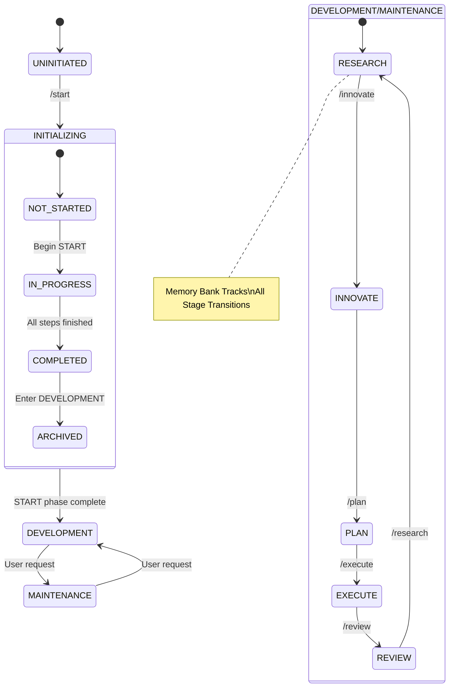

<!-- Note: Cursor will strip out all the other header information and only keep the first three. -->
# CursorRIPER Framework - State Management
# Version 1.0.2

## AI PROCESSING INSTRUCTIONS
This file defines the current state of the project within the CursorRIPER Framework. As an AI assistant, you MUST:
- Always load this file after core.mdc but before other components
- Never modify state values without proper authorization via commands
- Validate state transitions against allowed paths
- Update this file when state changes occur
- Keep all state values consistent with each other
- Initialize memory bank when entering DEVELOPMENT phase

## CURRENT PROJECT STATE

PROJECT_PHASE: "DEVELOPMENT"
# Possible values: "UNINITIATED", "INITIALIZING", "DEVELOPMENT", "MAINTENANCE"

RIPER_CURRENT_MODE: "EXECUTE"
# Possible values: "NONE", "RESEARCH", "INNOVATE", "PLAN", "EXECUTE", "REVIEW"

START_PHASE_STATUS: "COMPLETED"
# Possible values: "NOT_STARTED", "IN_PROGRESS", "COMPLETED", "ARCHIVED"

START_PHASE_STEP: 6
# Possible values: 0-6 (0=Not started, 1=Requirements, 2=Technology, 3=Architecture, 4=Scaffolding, 5=Environment, 6=Memory Bank)

LAST_UPDATE: "2025-01-27T13:40:00Z"
# ISO 8601 formatted timestamp of last state update

INITIALIZATION_DATE: "2025-01-27T10:00:00Z"
# When START phase was completed

FRAMEWORK_VERSION: "1.0.0"
# Current version of the framework

MEMORY_BANK_STATUS: "ENABLED"
# Possible values: "DISABLED", "INITIALIZING", "ENABLED", "ERROR"

WORKFLOW_CYCLE: 1
# Current RIPER workflow cycle number

STAGE_COMPLETION_TRACKING: true
# Whether to track stage completions in memory bank

## TASK PARSING CONFIGURATION

TASK_PARSING_ENABLED: true
# Whether task parsing and management is enabled

CURRENT_TASK_ID: "mockup_011"
# ID of currently selected task for execution

TASK_ITERATION_STATUS: "DISABLED"
# Possible values: "DISABLED", "PAUSED", "ACTIVE", "COMPLETED"

LAST_PRD_PARSE: "2025-09-17T00:00:00Z"
# ISO 8601 formatted timestamp of last PRD parsing

TOTAL_TASKS: 12
# Total number of tasks parsed from PRD

COMPLETED_TASKS: 10
# Number of tasks marked as completed

TASK_COMPLETION_PERCENTAGE: 83.33
# Calculated completion percentage (completed/total * 100)

## MEMORY BANK CONFIGURATION

MEMORY_BANK_INITIALIZED: true
# Whether memory bank has been set up

MEMORY_AUTO_SAVE: true
# Auto-save memory after significant actions

MEMORY_BACKUP_ENABLED: true
# Whether to create backups of memory bank

LAST_MEMORY_UPDATE: "2025-01-27T12:00:00Z"
# Last time memory bank was updated

## STATE TRANSITION RULES

### Phase Transitions
- UNINITIATED → INITIALIZING
  - Trigger: "/start" or "BEGIN START PHASE"
  - Requirements: None
  
- INITIALIZING → DEVELOPMENT
  - Trigger: Automatic upon START phase completion
  - Requirements: START_PHASE_STATUS = "COMPLETED"
  - Action: Initialize memory bank system
  
- DEVELOPMENT → MAINTENANCE
  - Trigger: Manual transition by user
  - Requirements: Explicit user request
  - Action: Archive current workflow cycle
  
- MAINTENANCE → DEVELOPMENT
  - Trigger: Manual transition by user
  - Requirements: Explicit user request
  - Action: Resume workflow from memory

### Mode Transitions (with Memory Bank)
- Any mode → RESEARCH
  - Trigger: "/research" or "ENTER RESEARCH MODE"
  - Requirements: PROJECT_PHASE in ["DEVELOPMENT", "MAINTENANCE"]
  - Action: Initialize/load research memory, load current task research requirements
  
- Any mode → INNOVATE
  - Trigger: "/innovate" or "ENTER INNOVATE MODE"
  - Requirements: PROJECT_PHASE in ["DEVELOPMENT", "MAINTENANCE"]
  - Action: Load research memory, initialize innovation memory, load task solution requirements
  
- Any mode → PLAN
  - Trigger: "/plan" or "ENTER PLAN MODE"
  - Requirements: PROJECT_PHASE in ["DEVELOPMENT", "MAINTENANCE"]
  - Action: Load innovation memory, initialize planning memory, enable PRD parsing if available
  
- Any mode → EXECUTE
  - Trigger: "/execute" or "ENTER EXECUTE MODE"
  - Requirements: PROJECT_PHASE in ["DEVELOPMENT", "MAINTENANCE"]
  - Action: Load planning memory, initialize execution memory, load current task implementation plan
  
- Any mode → REVIEW
  - Trigger: "/review" or "ENTER REVIEW MODE"
  - Requirements: PROJECT_PHASE in ["DEVELOPMENT", "MAINTENANCE"]
  - Action: Load execution memory, initialize review memory, load completed task results

### START Phase Status Transitions
- NOT_STARTED → IN_PROGRESS
  - Trigger: "/start" or "BEGIN START PHASE"
  - Requirements: PROJECT_PHASE = "UNINITIATED"
  
- IN_PROGRESS → COMPLETED
  - Trigger: Completion of all START phase steps
  - Requirements: START_PHASE_STEP = 6
  
- COMPLETED → ARCHIVED
  - Trigger: Automatic after transition to DEVELOPMENT
  - Requirements: PROJECT_PHASE = "DEVELOPMENT"

### Task Management Transitions
- DISABLED → ENABLED (Task Parsing)
  - Trigger: "/parse-prd" in PLAN mode
  - Requirements: PRD file exists, TASK_PARSING_ENABLED = true
  - Action: Parse PRD, create tasks.json, update TOTAL_TASKS
  
- null → task_id (Task Selection)
  - Trigger: "/select-task <task_id>" or "/next-task"
  - Requirements: Valid task exists, task dependencies met
  - Action: Update CURRENT_TASK_ID, load task context
  
- DISABLED → ACTIVE (Task Iteration)
  - Trigger: "/iterate-tasks"
  - Requirements: Tasks exist, TASK_PARSING_ENABLED = true
  - Action: Update TASK_ITERATION_STATUS, begin automated execution

## STATE UPDATE PROCEDURES

### Update Project Phase
1. Validate transition is allowed
2. Create backup of current state
3. Update PROJECT_PHASE value
4. Update LAST_UPDATE timestamp
5. Perform any phase-specific initialization
6. Initialize memory bank if entering DEVELOPMENT

### Update RIPER Mode (Enhanced)
1. Validate transition is allowed
2. Save current stage memory to memory bank
3. Update RIPER_CURRENT_MODE value
4. Update LAST_UPDATE timestamp
5. Load memory for new stage
6. Update riper-state.json in memory bank
7. Update activeContext.md to reflect mode change

### Update START Phase Status
1. Validate transition is allowed
2. Update START_PHASE_STATUS value
3. Update LAST_UPDATE timestamp
4. If transitioning to COMPLETED, set INITIALIZATION_DATE
5. Initialize memory bank system

### Update START Phase Step
1. Validate step increment is logical
2. Update START_PHASE_STEP value
3. Update LAST_UPDATE timestamp
4. If reaching step 6, trigger completion process

### Memory Bank State Updates
1. Update MEMORY_BANK_STATUS as needed
2. Update LAST_MEMORY_UPDATE timestamp
3. Increment WORKFLOW_CYCLE on review completion
4. Maintain stage completion tracking

### Task State Updates
1. **Update Task Progress**: Recalculate TASK_COMPLETION_PERCENTAGE
2. **Update Current Task**: Set CURRENT_TASK_ID when task selected
3. **Update Task Counts**: Increment COMPLETED_TASKS when tasks finished
4. **Update Iteration Status**: Modify TASK_ITERATION_STATUS as needed
5. **Update Parse Timestamp**: Set LAST_PRD_PARSE when PRD is parsed
6. **Sync Task Files**: Ensure tasks.json and current-task.json are current

## AUTOMATIC STATE DETECTION (Enhanced)

When determining current project state:
1. Check for existence of memory bank files
2. Check for existence of Holiday Planner App structure
3. If complete memory bank exists but PROJECT_PHASE is "UNINITIATED":
   - Set PROJECT_PHASE to "DEVELOPMENT"
   - Set START_PHASE_STATUS to "COMPLETED"
   - Set START_PHASE_STEP to 6
   - Set INITIALIZATION_DATE based on file timestamps
   - Set MEMORY_BANK_STATUS to "ENABLED"
4. If Holiday Planner App exists (holiday-planner-mobile directory):
   - Set PROJECT_PHASE to "DEVELOPMENT" 
   - Set RIPER_CURRENT_MODE to "REVIEW"
   - Enable memory bank tracking
5. If partial memory bank exists:
   - Set PROJECT_PHASE to "INITIALIZING"
   - Set START_PHASE_STATUS to "IN_PROGRESS"
   - Determine START_PHASE_STEP based on existing files

## RE-INITIALIZATION PROTECTION

If "/start" or "BEGIN START PHASE" is detected when PROJECT_PHASE is not "UNINITIATED":
1. Warn user about re-initialization risks
2. Require explicit confirmation: "CONFIRM RE-INITIALIZATION"
3. If confirmed:
   - Create backup of current memory bank
   - Reset state to PROJECT_PHASE = "INITIALIZING"
   - Reset START_PHASE_STATUS to "IN_PROGRESS"
   - Reset START_PHASE_STEP to 1
   - Preserve existing memory bank with backup timestamp

---

*This file automatically tracks the current state of the project. It should never be edited manually.*
